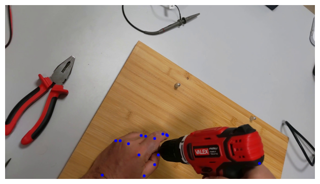
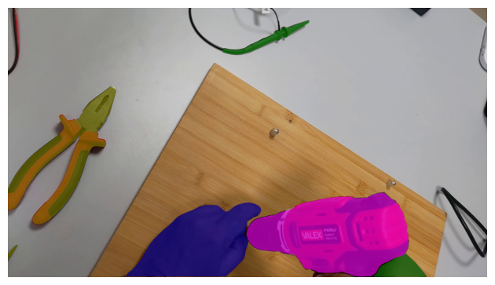

# The ENIGMA-51 Dataset
This is the official github repository related to the ENIGMA-51 Dataset.

<div align="center">
  
</div>

ENIGMA-51 is a new egocentric dataset acquired in an industrial scenario by 19 subjects who followed instructions to complete the repair of electrical boards using industrial tools (e.g., electric screwdriver) and equipments (e.g., oscilloscope). ENIGMA-51 has been annotated with a rich set of annotations which allows to study large variety of tasks, especially tasks related to human-object interactions.

You can download the ENIGMA-51 dataset and its annotations from the [project web page](https://iplab.dmi.unict.it/ENIGMA-51/).


## Citing the ENIGMA-51 Dataset
If you find our work useful in your research, please use the following BibTeX entry for citation.
```
@article{ragusa2023enigma51,
  title={ENIGMA-51: Towards a Fine-Grained Understanding of Human-Object Interactions in Industrial Scenarios},
  author={Francesco Ragusa and Rosario Leonardi and Michele Mazzamuto and Claudia Bonanno and Rosario Scavo and Antonino Furnari and Giovanni Maria Farinella},
  journal={IEEE Winter Conference on Application of Computer Vision (WACV)},
  year={2024}
}

```

## Table of Contents

* [Model Zoo and Baselines](#model-zoo-and-baselines)
* [Visualization Script for Object and Hand Keypoints with Mask Annotations](#visualization-script-for-object-and-hand-keypoints-with-mask-annotations)


## Model Zoo and Baselines:

* [Untrimmed Temporal Detection of Human-Object Interactions](#untrimmed-temporal-detection-of-human-object-interactions)
* [Egocentric Human-Object Interaction Detection](#egocentric-human-object-interaction-detection)
* [Short-Term Object Interaction Anticipation](#short-term-object-interaction-anticipation)
* [NLU of Intents and Entities](#nlu-of-intents-and-entities)

## Untrimmed Temporal Detection of Human-Object Interactions

### Introduction
The instructions below will guide you on replicating the baseline for the Untrimmed Temporal Detection of Human-Object Interactions task or training your own model.
The baseline is based on [ActionFormer](https://arxiv.org/abs/2202.07925), refer to the [official repository](https://github.com/happyharrycn/actionformer_release) for more details.

### Download Features, Annotations, and other needed files
* Download *enigma_UAD.tar.gz* from [this link](https://iplab.dmi.unict.it/sharing/ENIGMA-51/UAD.tar.gz).
* The file includes features, action annotations in JSON format, the custom dataset file (.py), and 3 different config files for each task variant (ht_hr, fc_hd, ht_hr_fc_hd).

**Details**: The features are extracted from a two-stream network pretrained on ActivityNet. Each video chunk is set to a size of 6, and there is no overlapping between adjacent chunks. With a video frame rate of 30, we get 5 chunks per second. For appearance features, we extract data from the Flatten 673 layer of ResNet-200 from the central frame of each chunk. Motion features are extracted from the global pool layer of BN-Inception from optical flow fields computed from the 6 consecutive frames within each chunk. Motion and appearance features are then concatenated.

**Needed steps**
* Features and annotations should be placed under *./data/enigma*
* Config files should be placed under *./configs*
* The custom dataset file should be placed under *./libs/datasets*
* In the `libs/datasets/__init__.py` file, include the import of `enigma` (the dataset name in the custom dataset file set within `@register_dataset()`).
* In the `eval.py` file, replace all the instances of **"val_split"** with **"test_split"**.

The folder structure should look like this: 
```
This folder
│   README.md
│   ...  
|
└───configs/
│    └───enigma_ht_hr_fc_hd.json
│    └───enigma_ht_hr.json
│    └───enigma_fc_hd.json
│    └───...
|
└───data/
│    enigma/
│    │   └───annotations
│    │        └───enigma_ht_hr_fc_hd.json
│    │        └───enigma_ht_hr.json
│    │        └───enigma_fc_hd.json
│    │   └───features   
│    └───...
|
└───libs/
|     └───datasets
|     |      └───enigma.py
│     |      └───...
│     └───...
│   ...
```

### Training and Evaluation
* Choose the config file for training ActionFormer on ENIGMA-51.
* Train the ActionFormer network. This will create an experiment folder under *./ckpt* that stores training config, logs, and checkpoints.
```shell
python ./train.py ./configs/enigma_ht_hr.yaml --output reproduce
```
* Save the predictions of the trained model by running this script.
```shell
python ./eval.py ./configs/enigma_ht_hr.yaml ./ckpt/enigma_ht_hr_reproduce --saveonly
```
* To evaluate the trained model, you should run the [mp_mAP.py](UAD/mp_mAP/mp_mAP.py) file, specifying the path to the prediction file, and the path to the testing ground truth file. For more details, please refer to the [mp_mAP.py](UAD/mp_mAP/mp_mAP.py).py file.

### Evaluating on Our Pre-trained Model

We also provide the pre-trained models for the 3 different variants of the task (ht_hr, fc_hd, ht_hr_fc_hd). The models with the relative configs can be downloaded from [this link](https://iplab.dmi.unict.it/sharing/ENIGMA-51/UAD_pretrained.tar.gz). To evaluate the pre-trained model, please follow the steps listed below.

* Move the config files to the config folder or specify the right path in the script below.
* Create a folder *./pretrained*, then a folder for each task variant and move the weight file under them.
* The folder structure should look like
```
This folder
│   README.md
│   ...  
│
└───pretrained/
│    └───enigma/
│    |   └───ht_hr
│    |    └───...    
│    |   └───fc_hd
│    |    └───... 
│    |   └───ht_hr_fc_hd
│    |    └───...
│    |    
│    └───...
|
└───libs
│
│   ...
```
* Save the predictions of the trained model by running this script.
```shell
python ./eval.py ./configs/enigma_ht_hr.yaml ./pretrained/enigma/ht_hr --saveonly
```
* To evaluate the trained model, you should run the [mp_mAP.py](UAD/mp_mAP/mp_mAP.py) file, specifying the path to the prediction file, and the path to the testing ground truth file. For more details, please refer to the [mp_mAP.py](UAD/mp_mAP/mp_mAP.py).py file.


## Egocentric Human-Object Interaction Detection
The instructions below will guide you on replicating the baseline for the Egocentric Human-Object Interaction Detection task.
The baseline is based on [egoism-hoi](https://github.com/NextVisionLab/egoism-hoi), refer to the official repository for more details.

To train the model enter the following command:
```shell
python train.py --config PATH_OF_CFG --train_json PATH_OF_EHOI_TRAIN_ANNS --test_json PATH_OF_EHOI_VAL_ANNS --test_dataset_names enigma_val
```

To test the models run the command below:
```shell
python test.py --dataset_json PATH_TEST_ANNS --dataset_images PATH_TEST_IMGS --weights_path WEIGHTS_PATH
```

We provided the best model trained on the Training Set of the ENIGMA-51 Dataset.
| architecture | model | config |
| ------------- | ------------- | -------------| 
| egoism-hoi | [link](https://iplab.dmi.unict.it/sharing/ENIGMA-51/ENIGMA-51_model_ehoi.zip) | configs/cfg_ehoi.yaml |

## Short-Term Object Interaction Anticipation

#### StillFast model
We provided the best model trained on the Training Set of the ENIGMA-51 Dataset.
| architecture | model | config |
| ------------- | ------------- | -------------| 
| StillFast | [link](https://iplab.dmi.unict.it/sharing/ENIGMA-51/StillFast_ENIGMA-51_epoch_19.ckpt) | configs/STA_config.yaml |

Please, refer to the official page of [StillFast](https://github.com/fpv-iplab/stillfast) for additional details.

## NLU of Intents and Entities

The instructions below will guide you on replicating the baseline for the NLU of Intents and Entities task.

Set up a new Conda environment and a brand new RASA project running the commands below: 
```shell
conda create -n rasaenv python=3.7
conda activate rasaenv
pip3 install -U --user pip && pip install rasa==3.4
pip3 install -U spacy
python3 -m spacy download en_core_web_sm
rasa init
```

In your RASA project folder, overwrite the `config.yml` and `domain.yml` with our provided configuration and [domain](configs/domain.yml) files.
Inside the `data` folder, put your training/test data and overwrite the `rules.yml` with our provided [rules](configs/rules.yml) file.
Put our model inside the `models` folder. 

We provided the best model trained on the Training Set of the ENIGMA-51 utterances annotations.
| architecture | model | config |
| ------------- | ------------- | -------------| 
| DIETClassifier | [link](https://iplab.dmi.unict.it/sharing/ENIGMA-51/DIETClassifier_ENIGMA-51.gz) | configs/NLU_config.yml |

To train the model enter the following command:
```shell
rasa train nlu --nlu data/your_training_data.yml -c config/nlu_config.yml
```

To test the models run the command below:
```shell
rasa test nlu --nlu data/your_test_data.yml -c config/nlu_config.yml
```

Please, refer to the official page of [RASA CLI](https://rasa.com/docs/rasa/command-line-interface/) for additional details.

## Visualization Script for Object and Hand Keypoints with Mask Annotations

This script is designed to visualize object and hand keypoints with mask annotations using preprocessed data files. It utilizes various libraries like OpenCV, NumPy, Matplotlib, and Torch to load and display the data. The script assumes that you have already downoloaded the required JSON and npy files, as it loads them to visualize the annotations.
Hands keypoint            |  Object and hand mask
:-------------------------:|:-------------------------:
  |  

### Prerequisites🛠️

Before running the script, ensure you have the following:

- Python 3.x installed. 🐍
- Conda package manager installed (https://docs.conda.io/projects/conda/en/latest/user-guide/install/index.html).

### Setup🔧

1. Create a new Conda environment and install the required packages:
```bash
conda create -n your_env_name python=3.x
conda activate your_env_name
conda install matplotlib numpy torch torchvision opencv
```
Replace your_env_name with the desired environment name, and replace 3.x with the desired Python version (e.g., 3.7, 3.8, or 3.9).💻

### Usage 🚀

Activate the Conda environment:
```bash
conda activate your_env_name
```

Make sure to replace your_env_name with the environment name you created.
The script will load the JSON and npy files and visualize the annotations on a sample image.📑🔍

### Outputs 🖼️
The script will display a plot containing the following:
Blue circles representing hand keypoints on a resized sample image from the dataset. 👉🔵
Colored polygons representing object masks with class-specific colors. 🎨🔴🟢🟡🟣


### Note 📝
The script uses random selection to display annotations for a random key from the dataset. If you want to visualize annotations for a specific key, modify the "random_key" variable in the script to the desired key. 🎲
The class_colors dictionary can be modified to map class IDs to your preferred colors. 🎨🔤
Feel free to modify the script as per your requirements, such as customizing colors, filtering keypoints, or adjusting image sizes. Happy visualizing! 🎉🔍

